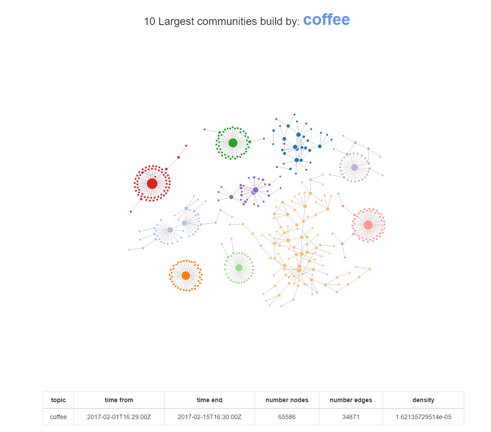
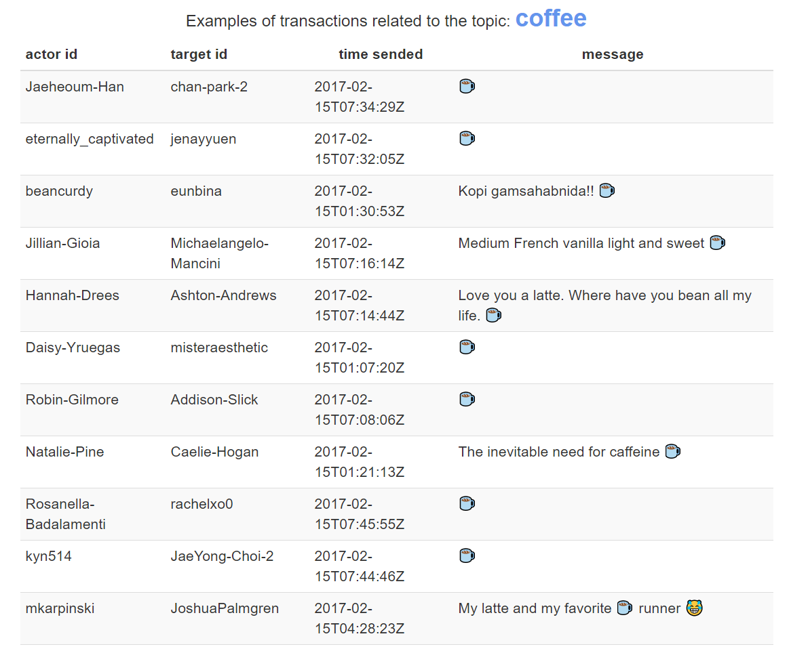
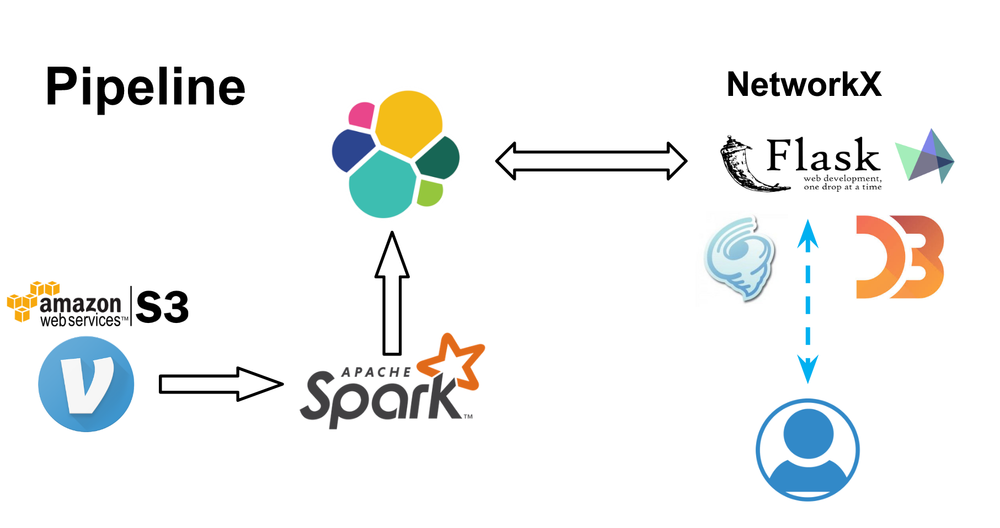

Spider-Mo
==========
Insight Data Engineering Project - Discover how topics connecting people

## Website : 
[Spider-Mo](http://spider-mo.site)

## Presentation :
[Slides](https://docs.google.com/presentation/d/1Tazc5F2oVl9uBrQb_L0HOela_EKdrTV4ODCIGhZOvMI/pub?start=true&loop=false&delayms=3000#slide=id.p13)

## Examples :
How coffee bring people together in recent 2 weeks?

Spider-Mo will tell you the top 10 communities that was built by coffee.

----------

----------

# Intro
Similar to spiders building webs, different topics build different social network among us.
Spider-Mo is a social network analyze platform that can help you to discover how topics bring people together.

Just type the topic you are interested and define the time range, Spider-Mo will show you the unique social network build by that topic.
Beside, Spider-Mo also has the following applications: 

-	Monitoring the trend of topics.
-	Evaluating advertising effectiveness.
-	Discovering communities and hubs for certain topics.
-	Fraud detection. 
  

# Data
Spider-Mo use the transaction data from Venmo, which record the payments and message between friends.
A payment represent a social interaction between two users and the message gives us the information about this connection.
Bu analyze the message they send, we can know what topics make these two user get connected.

#Pipeline

Venmo data is read from S3 and processed by a spark running on 4 node cluster.
The spark cluster do filtering, information extraction and write to an elasticsearch database.
The front end is served with a flask app which query the data from elasticsearch based on the keyword and time range defined by the user.
The graphical calculation about the social network build by searching results is performed by NetworkX.
Finnally, the visualization is done by D3 and highchart.

 

